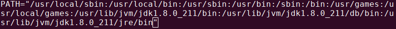

# My Linux Environment  

Setup and software of my personal laptop, powered by [Ubuntu Linux 18.04](http://mirror.globo.com/ubuntu/releases/18.04.1/ubuntu-18.04.1-desktop-amd64.iso).  

## First Update

This is the first thing you should do after fresh installing Ubuntu.

```bash
$ sudo apt update && sudo apt upgrade
```

## Enable Canonical Partners repo

```bash
$ sudo sed -i 's/# deb http/deb http/g' /etc/apt/sources.list
$ sudo apt update
```

## Install Build Essential, Python-setuptools and Python-dev

```bash
$ sudo apt install build-essential python-setuptools python-dev
```

## Install Media Codecs

```bash
$ sudo apt install ubuntu-restricted-extras
```

## Enable 'Minimize on Click' for the Ubuntu Dock

```bash
$ gsettings set org.gnome.shell.extensions.dash-to-dock click-action 'minimize'
```

## Gnome Tweaks

```bash
$ sudo apt install gnome-tweaks
```
## Curl

```bash
$ sudo apt install curl
```

## Java  

```bash
$ sudo add-apt-repository ppa:webupd8team/java
$ sudo apt-get install oracle-java8-installer
$ java -version
$ javac -version
$ JAVA_HOME="/usr/lib/jvm/java-8-oracle"
$ export JAVA_HOME
$ source ~/.bashrc
```

## Anaconda
```bash
$ cd /tmp
$ wget https://repo.anaconda.com/archive/Anaconda3-5.3.1-Linux-x86_64.sh
$ bash ./Anaconda3-5.3.1-Linux-x86_64.sh
$ conda update --all
```

## Flatpak  

Flatpak is a universal packaging system from Fedora. Like Snap, you can install Flatpak packaged applications in various Linux distributions that support Flatpak.  
Snap is cool, but I had a lot of trouble usuing it. So, I tried to use flatpak and worked very well.  
I loved it.

```bash
$ sudo add-apt-repository ppa:alexlarsson/flatpak
$ sudo apt install flatpak
$ sudo apt install gnome-software-plugin-flatpak
$ flatpak remote-add --if-not-exists flathub https://flathub.org/repo/flathub.flatpakrepo
```  

And restart the system

```bash
$ sudo shutdown -r now
```  

## Now install some apps from FLATHUB

Search for apps:

```bash
$ flatpak search gimp
```  

And install:

```bash
$ flatpak install flathub org.gimp.GIMP
```  

See and install others apps in [Flathub](https://flathub.org/home)  

[Flatpak command](http://docs.flatpak.org/en/latest/using-flatpak.html#the-flatpak-command)

### Android Studio

```bash
$ flatpak install flathub com.google.AndroidStudio
```  
Start Android Studio application, configure, install sdk and create a empty project to test.  

## Node  

```bash
$ curl -o- https://raw.githubusercontent.com/creationix/nvm/v0.33.11/install.sh | bash
$ source ~/.bashrc
$ nvm ls-remote
$ nvm install 8.14.0
```  

## IONIC

```bash 
$ npm install -g ionic
$ npm install -g cordova
$ ionic start myApp tabs
$ cd myApp/
$ ionic serve
```  
If it works smoothly continue to build on Android device

### Build on device

```bash 
$ sudo apt install adb
```  
Open the file:

```bash 
$ vim ~/.bashrc
```  
Add in the end of file:  
ANDROID_HOME=/home/rsouza/Android/Sdk  
PATH=${PATH}:$ANDROID_HOME/tools:$ANDROID_HOME/platform-tools:$ANDROID_HOME/build-tools

  

Save, exit and continue:

```bash 
$ source ~/.bashrc
$ curl -s "https://get.sdkman.io" | bash
$ source ~/.bashrc
$ sdk version
$ sdk install gradle 5.0
```  

Now, inside de project execute:

```bash 
$ ionic cordova run android --device
```  
## Install more applications with Flathub

### Code

```bash 
$ flatpak install flathub com.visualstudio.code
```  
[vscode is not able to detected bash as terminal](https://github.com/flathub/com.visualstudio.code/issues/39)  

Shell arguments

You can pass arguments to the shell when it is launched.

For example, to enable running bash as a login shell (which runs .bash_profile), pass in the -l argument (with double quotes):
// Linux
"terminal.integrated.shellArgs.linux": ["-l"]

https://code.visualstudio.com/docs/editor/integrated-terminal#_shell-arguments

### Arduino

```bash
$ flatpak install flathub cc.arduino.arduinoide
```  

### Atom

```bash
$ flatpak install flathub io.atom.Atom
```  

### DBeaver Community

```bash 
$ flatpak install flathub io.dbeaver.DBeaverCommunity
```  

### Inkscape

```bash 
$ flatpak install flathub org.inkscape.Inkscape
```  

### Kdenlive

```bash 
$ flatpak install flathub org.kde.kdenlive
```  

### LibreOffice

```bash 
$ flatpak install flathub org.libreoffice.LibreOffice
```  

### Mendeley

```bash 
$ flatpak install flathub com.elsevier.MendeleyDesktop
```  

### Slack

```bash 
$ flatpak install flathub com.slack.Slack
```  

### Telegram

```bash 
$ flatpak install flathub org.telegram.desktop
```  

### Spotify

```bash 
$ flatpak install flathub com.spotify.Client
```  

### Transmission

```bash 
$ flatpak install flathub com.transmissionbt.Transmission
```  

### Podcasts

```bash 
$ flatpak install flathub org.gnome.Podcasts
```  

### VLC

```bash 
$ flatpak install flathub org.videolan.VLC
```  

## Acknowledgments

[FOSS](https://itsfoss.com/things-to-do-after-installing-ubuntu-18-04/)  
[OMG Ubuntu](https://www.omgubuntu.co.uk/2018/04/things-to-do-after-installing-ubuntu-18-04)  
[NVM](https://github.com/creationix/nvm)  
[IONIC](https://ionicframework.com/docs/intro/installation/)
 

