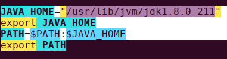

# My Linux Environment  

Setup and software of my personal laptop, powered by [Ubuntu Linux 19.04](http://releases.ubuntu.com/19.04/ubuntu-19.04-desktop-amd64.iso).  

## First Update

This is the first thing you should do after fresh installing Ubuntu.

```bash
$ sudo apt update && sudo apt upgrade
```

## Enable Canonical Partners repo

```bash
$ sudo sed -i 's/# deb http/deb http/g' /etc/apt/sources.list
$ sudo apt update
```

## Install Build Essential, Python-setuptools and Python-dev

```bash
$ sudo apt install build-essential python-setuptools python-dev python3-distutils
```

## Install Media Codecs

```bash
$ sudo apt install ubuntu-restricted-extras
```

## Enable 'Minimize on Click' for the Ubuntu Dock

```bash
$ gsettings set org.gnome.shell.extensions.dash-to-dock click-action 'minimize'
```

## Gnome Tweaks and Show/Hide All Hidden Startup Applications

```bash
$ sudo apt install gnome-tweaks
$ sudo sed -i 's/NoDisplay=true/NoDisplay=false/g' /etc/xdg/autostart/*.desktop
```
## Curl

```bash
$ sudo apt install curl
```

## Java 8  

Download [JDK 8](https://www.oracle.com/technetwork/pt/java/javase/downloads/jdk8-downloads-2133151.html) 

```bash
$ sudo cp jdk-8u211-linux-x64.tar.gz /usr/lib/jvm/
$ cd /usr/lib/jvm/
$ sudo tar -xvzf jdk-8u211-linux-x64.tar.gz
$ sudo rm -rf jdk-8u211-linux-x64.tar.gz
```
Open the file /etc/environment and insert: /usr/lib/jvm/jdk1.8.0_211/bin:/usr/lib/jvm/jdk1.8.0_211/db/bin:/usr/lib/jvm/jdk1.8.0_211/jre/bin

  

Open thw file ".bashrc" and insert:



## Node  

```bash
$ curl -o- https://raw.githubusercontent.com/creationix/nvm/v0.34.0/install.sh | bash
$ source ~/.bashrc
$ nvm ls-remote
$ nvm install 8.16.0
```  

## IONIC

```bash 
$ npm install -g ionic@latest-3
$ npm install -g cordova
$ ionic start myApp tabs
$ cd myApp/
$ ionic serve
```  
If it works smoothly continue to build on Android device

### Build on device

```bash 
$ sudo apt install adb
```  
Open the file:

```bash 
$ vim ~/.bashrc
```  
Add in the end of file:  
ANDROID_SDK_ROOT=/home/rsouza/Android/Sdk  
PATH=${PATH}:$ANDROID_SDK_ROOT/tools:$ANDROID_SDK_ROOT/platform-tools:$ANDROID_SDK_ROOT/build-tools

Save, exit and continue:

```bash 
$ source ~/.bashrc
$ curl -s "https://get.sdkman.io" | bash
$ source ~/.bashrc
$ sdk version
$ sdk install gradle 5.0
```  

Now, inside de project execute:

```bash 
$ ionic cordova run android --device
```  

## Acknowledgments

[OMG Ubuntu](https://www.omgubuntu.co.uk/2018/04/things-to-do-after-installing-ubuntu-18-04)  
[NVM](https://github.com/creationix/nvm)  
[IONIC](https://ionicframework.com/docs/intro/installation/)
 

